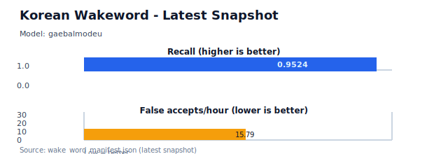

<div align="center">

# Korean Wakeword

**Request Korean micro wake word models through GitHub Issues.**

[](https://github.com/UnripePlum/korean-wakeword/actions/workflows/validate.yml)
[](wake_word_manifest.json)
[](#request-rules)
[](#quick-start)

[Quick Start](#quick-start) ·
[Published Layout](#published-layout) ·
[Evaluation](#evaluation) ·
[Performance](#performance) ·
[Manifest](wake_word_manifest.json) ·
[Docs](#docs) ·
[Contact](#contact)

</div>

---

Korean Wakeword is a public catalog for Korean micro wake word requests and published model artifacts. Create an issue like `요청:자비스`; after approval and generation, this repository receives a model folder plus an updated manifest.

## Quick Start

1. Open a new GitHub Issue.

   [Request a wake word](https://github.com/UnripePlum/korean-wakeword/issues/new?title=%EC%9A%94%EC%B2%AD%3A%EC%9E%90%EB%B9%84%EC%8A%A4)

2. Write the issue title or body like this:

   ```text
   요청:자비스
   ```

3. Wait for the request to be approved and generated.

4. Use the published `.tflite`, metadata JSON, or manifest entry.

## What Gets Published

When a request is processed, the generated model appears as a folder:

```text
jarvis/2026-06-08T03-42-20Z/jarvis.json
jarvis/2026-06-08T03-42-20Z/jarvis.tflite
```

The model is also indexed in:

```text
wake_word_manifest.json
```

## Request Rules

- Use Korean.
- Keep the wake word at 8 syllables or fewer.
- Use the format `요청:<wakeword>`.

## Published Layout

```text
<artifact_slug>/<generation_version>/<artifact_slug>.json
<artifact_slug>/<generation_version>/<artifact_slug>.tflite
wake_word_manifest.json
```

`generation_version` is the UTC generation start timestamp, formatted as
`YYYY-MM-DDTHH-MM-SSZ`.

## Use the Manifest

`wake_word_manifest.json` is the public index of generated models. Each entry points to the model file, metadata file, runtime settings, and public-safe generation metadata.

## Evaluation

Each model metadata file may include public evaluation results:

| Field | Meaning |
| --- | --- |
| `metrics.recall` | How often the model detects the target wake word in evaluation samples. Higher is better. |
| `metrics.false_accepts_per_hour` | Estimated false wakeups per hour. Lower is better. |
| `runtime.probability_cutoff` | Suggested detection threshold for runtime use. |

Evaluation quality can vary by device, microphone, background noise, and runtime settings. Treat the metrics as a starting point, then tune the cutoff for your own environment.

## Performance

This section is regenerated from `wake_word_manifest.json` when models are published.



<!-- KWW:PERFORMANCE_TABLE_START -->
| Wakeword | Slug | Generation | Recall | False accept rate | False accepts/hour | Cutoff | Training |
| --- | --- | --- | ---: | ---: | ---: | ---: | ---: |
| 바둑이 | `baduki` | `2026-06-17T21-08-48Z` | 95.0% | 0.00% | 0 | 1 | 4.21 min |
| 변신 | `byeonsin` | `2026-06-18T08-45-39Z` | 95.0% | 0.00% | 0 | 1 | 3.92 min |
| 개발모드 | `gaebalmodeu` | `2026-06-18T15-23-36Z` | 95.0% | 0.00% | 0 | 1 | 4.84 min |
| 가재모드 | `gajaemode` | `2026-06-17T18-15-38Z` | 95.0% | 0.43% | 7.807 | 0.79 | 4.45 min |
| 게임모드 | `geimmodeu` | `2026-06-18T04-55-23Z` | 95.0% | 0.00% | 0 | 0.99 | 4.57 min |
| 자비스 | `jarvis` | `2026-06-17T19-55-59Z` | 95.0% | 0.43% | 7.904 | 1 | 4.29 min |
| 넙죽 | `nubjuk` | `2026-06-17T20-16-06Z` | 95.0% | 0.00% | 0 | 1 | 3.69 min |
| 업무시작 | `workstart` | `2026-06-17T20-08-04Z` | 95.0% | 0.43% | 7.872 | 0.62 | 4.18 min |
<!-- KWW:PERFORMANCE_TABLE_END -->

### Metric Definitions

| Field | Meaning | Higher is better |
| --- | --- | --- |
| `recall` | Detection rate for target wake words. | yes |
| `false_accept_rate` | False accepts divided by evaluated negatives. | no |
| `false_accepts_per_hour` | Estimated false acceptance rate per hour. | no |
| `probability_cutoff` | Runtime detection threshold. | tune by environment |
| `training_duration_minutes` | Training duration in minutes. | - |

## Docs

- [Architecture](docs/ARCHITECTURE.md)
- [Publishing contract](docs/PUBLISHING.md)
- [Security notes](docs/SECURITY.md)

## Contact

For questions or artifact requests, email [unripeplum03@gmail.com](mailto:unripeplum03@gmail.com).

<details>
<summary>Maintainer commands</summary>

Run these before publishing artifact changes:

```sh
python -m unittest discover -s tests
python scripts/manifest/generate.py --check
```

</details>
