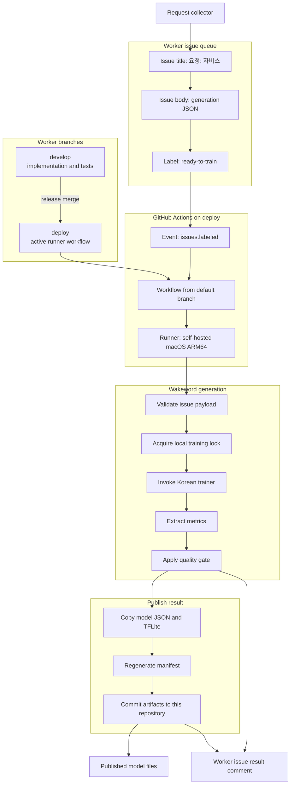
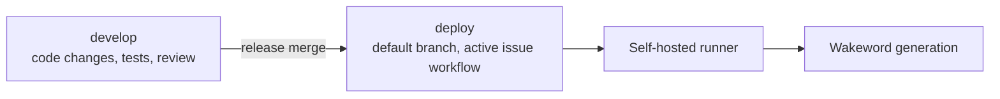
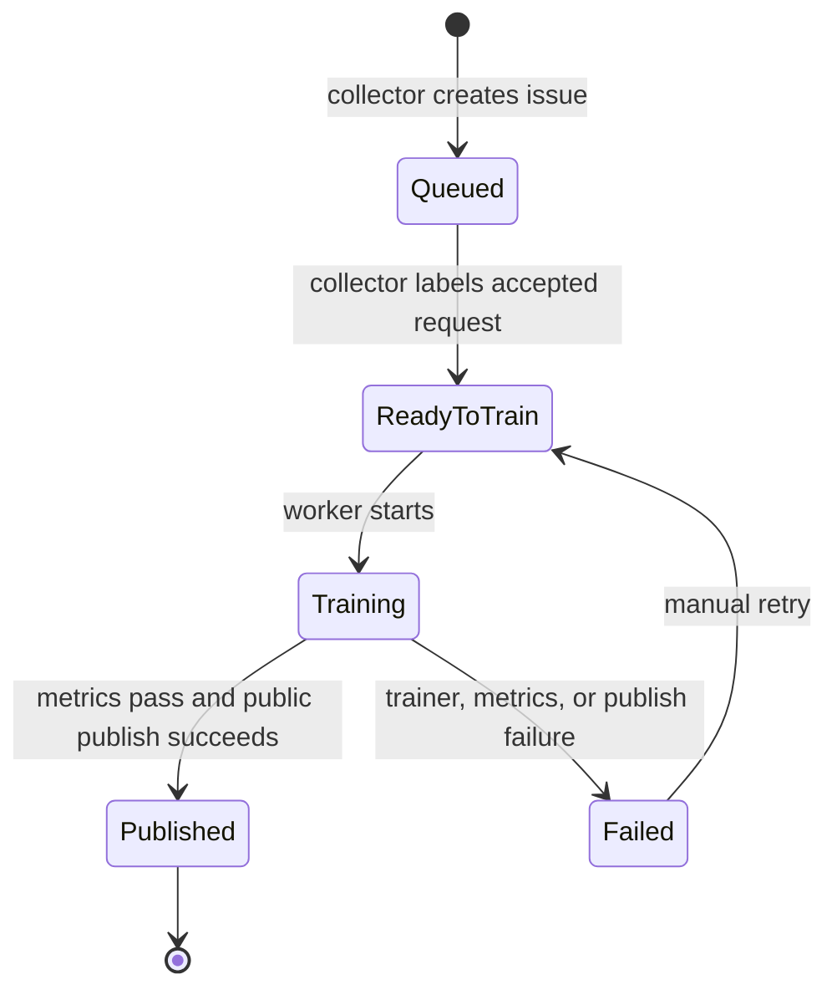

# Worker Architecture

## Role

`UnripePlum/korean-wakeword` is the public issue-driven worker for Korean wakeword generation.

It does not poll Threads. The private request collector creates public-safe issues in this repository. The worker consumes those issues, trains wakeword models on the local Apple Silicon self-hosted runner, and stores finished artifacts in this same repository.

## High-Level Flow



## Responsibilities

The worker owns:

- the public worker issue queue;
- wakeword generation job state;
- self-hosted runner workflow;
- training wrapper;
- metrics extraction;
- quality gate;
- artifact publication into this repository;
- worker issue comments and labels.

The worker does not own:

- Threads polling;
- Threads request parsing;
- requester eligibility checks;
- direct Threads replies.

Those belong to `UnripePlum/korean-wakeword-request-collector`.

## Branch Model

The worker always keeps development and deployment separated.



Rules:

- `develop` is for implementation work.
- `deploy` is the production branch for issue-triggered worker execution.
- `deploy` is the GitHub default branch so `issues.labeled` workflows run from deployed code.
- The self-hosted runner workflow must be active only from `deploy`.
- Release changes move from `develop` to `deploy` after tests and review.

## Issue Queue

Worker issues are created by the request collector.

Issue title:

```text
요청: 자비스
```

Required lifecycle labels:

- `queued`
- `ready-to-train`
- `training`
- `published`
- `failed`
- `rejected`

The worker starts only when `ready-to-train` is added.

## State Machine



Only one local training job should run at a time. The wrapper must acquire a local file lock before invoking the trainer.

## Wakeword Generation

The worker receives:

- Korean display phrase;
- normalized phrase;
- deterministic ASCII artifact slug;
- collector request ID for idempotency and status correlation;
- target publication repository.

The worker must:

- validate the issue payload again;
- recompute or verify `artifact_slug`;
- pass the Korean phrase to the trainer;
- pass the ASCII artifact slug as the output-safe name;
- extract metrics;
- publish only after the metrics gate passes.

## Publishing

Successful worker jobs publish into this repository:

```text
UnripePlum/korean-wakeword
```

Published files:

```text
microWakeWordsKorean/<artifact_slug>.json
microWakeWordsKorean/<artifact_slug>.tflite
wake_word_manifest.json
```

## Result Reporting

The worker reports results by updating the worker issue:

- label transition;
- result comment;
- artifact URLs;
- metrics;
- failure code when failed.

The request collector may read these issue updates and mirror the final status back to Threads.
