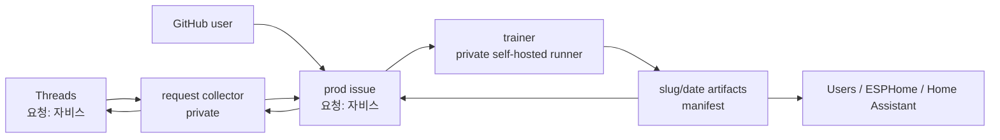
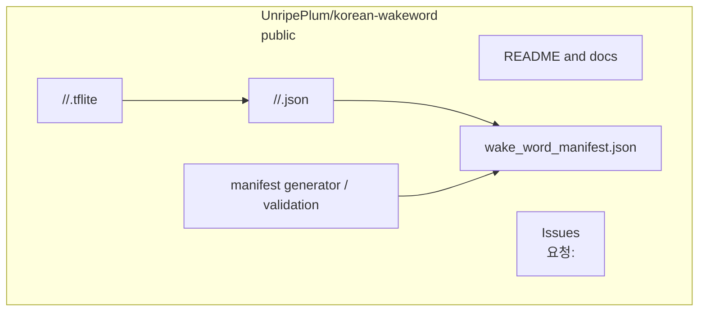

# Prod Architecture

## Role

`UnripePlum/korean-wakeword` is the public prod repository.

It stores public wakeword request issues, finished Korean wakeword artifacts, the public manifest, and user-facing documentation. It does not run local training and does not own the self-hosted runner.

## System Architecture



## Prod Repository Internals



## Responsibilities

Prod owns:

- public project docs;
- public wakeword request issues;
- published `.json` wakeword descriptors;
- published `.tflite` wakeword models;
- public manifest;
- manifest generation and validation scripts;
- public issue feedback about published models.

Prod does not own:

- Threads polling;
- follower or allowlist decisions;
- private request mappings;
- self-hosted runner workflow;
- local trainer cache;
- training secrets.

## Artifact Contract

Each successful trainer job writes:

```text
<artifact_slug>/<generation_start_date>/<artifact_slug>.json
<artifact_slug>/<generation_start_date>/<artifact_slug>.tflite
```

Then it updates:

```text
wake_word_manifest.json
```

`generation_start_date` is the date when trainer generation starts, formatted as `YYYY-MM-DD`.

`artifact_slug` is the English-safe wakeword folder name derived from the Korean phrase, for example `jarvis` or `nukjuk`. It must be lowercase ASCII and safe as a Git path segment.

The model JSON must include `trainer_version`.

## Source of Writes

Artifacts are written by `UnripePlum/korean-wakeword-trainer`.

The trainer may push directly for MVP. Later, it can open pull requests for manual artifact review.

## Request Issue Contract

GitHub users can open issues directly in this repository.

Issue title:

```text
요청: 자비스
```

Issue labels:

- `queued`
- `ready-to-train`
- `training`
- `published`
- `failed`
- `rejected`

The private trainer only executes when a trusted actor adds `ready-to-train`.

For Threads-originated requests, the collector adds `ready-to-train` only after verifying that the requester follows the owner account.

For GitHub-originated requests, a maintainer or trusted automation must add `ready-to-train`.
