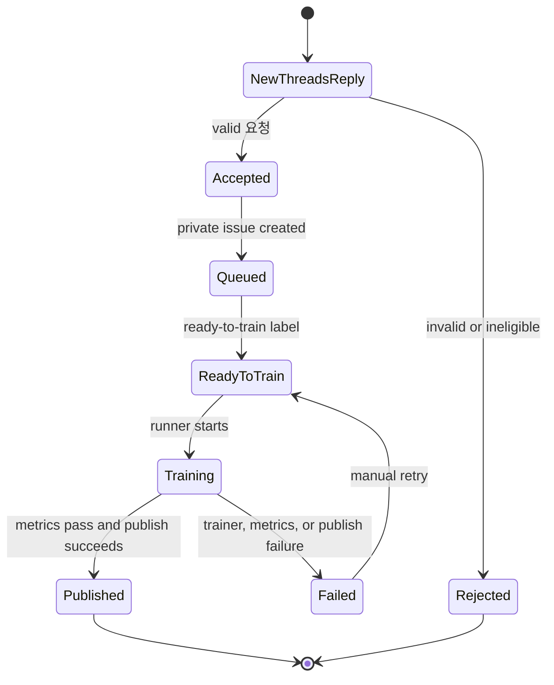

# Ops Architecture

## Role

`UnripePlum/korean-wakeword-ops` is the private control plane for Korean wakeword generation.

It owns:

- Threads request intake;
- request validation and deduplication;
- private GitHub issue queue;
- local Apple Silicon self-hosted runner execution;
- Korean wakeword training;
- metrics extraction and quality gates;
- publishing to the public distribution repository;
- status mirroring back to Threads.

The public distribution repository is `UnripePlum/korean-wakeword`.

## High-Level Flow

```mermaid
flowchart TD
    A["Threads reply<br/>요청: 자비스"]

    subgraph BRIDGE["threads_bridge"]
        B1["Fetch replies"]
        B2["Parse 요청:"]
        B3["Check requester eligibility"]
        B4["Normalize phrase"]
        B5["Compute artifact slug"]
        B6["Deduplicate by Threads reply ID"]
    end

    subgraph ISSUE["Private GitHub issue"]
        C1["Title: 요청: 자비스"]
        C2["Body: request JSON"]
        C3["Labels: queued, ready-to-train"]
    end

    subgraph ACTIONS["GitHub Actions"]
        D1["Event: issues.labeled"]
        D2["Runner: self-hosted macOS ARM64"]
    end

    subgraph TRAIN["Training wrapper"]
        E1["Validate issue payload again"]
        E2["Acquire local training lock"]
        E3["Invoke Korean trainer"]
        E4["Extract metrics"]
        E5["Enforce quality gate"]
    end

    subgraph PUBLISH["Publisher"]
        F1["Copy .json/.tflite into public checkout"]
        F2["Regenerate manifest"]
        F3["Commit and push to UnripePlum/korean-wakeword"]
    end

    subgraph STATUS["Status mirror"]
        G1["Comment on private issue"]
        G2["Reply to original Threads comment"]
    end

    A --> B1 --> B2 --> B3 --> B4 --> B5 --> B6
    B6 --> C1 --> C2 --> C3
    C3 --> D1 --> D2
    D2 --> E1 --> E2 --> E3 --> E4 --> E5
    E5 --> F1 --> F2 --> F3
    F3 --> G1 --> G2
```



## Components

### `threads_bridge`

Purpose:

- discover replies to the configured Threads request post;
- accept only `요청: <wakeword>` comments;
- create one private issue per accepted Threads reply;
- add `ready-to-train` only after validation passes;
- post accepted, failed, and completed status messages back to Threads.

Planned modules:

```text
threads_bridge/
  poll_replies.py
  parse_request.py
  requester_policy.py
  issue_queue.py
  status_reply.py
```

### Private Issue Queue

GitHub Issues in this private repository are the source of truth for jobs.

The issue queue provides:

- durable status;
- retry visibility;
- manual override through labels;
- human-readable failure comments;
- deduplication by Threads reply ID.

### Training Workflow

The workflow runs only on `issues.labeled` when `ready-to-train` is added.

The workflow does not parse the wakeword in shell. It calls one Python wrapper and passes `GITHUB_EVENT_PATH`.

### Training Wrapper

Planned modules:

```text
scripts/training/
  train_ko_issue.py
  issue_payload.py
  slugify_korean.py
  trainer_command.py
  extract_metrics.py
  quality_gate.py
  publish_to_distribution_repo.py
```

Responsibilities:

- validate the event came from a private issue;
- fetch and validate the issue body;
- recompute or verify `artifact_slug`;
- set Korean trainer environment variables;
- pass wakeword input as structured arguments;
- find generated `.json` and `.tflite`;
- parse metrics;
- decide `published` vs `failed`;
- publish artifacts only after the metrics gate passes.

### Publisher

The publisher owns the write path into the public repository.

Initial strategy:

- maintain a clean local checkout of `UnripePlum/korean-wakeword`;
- copy finished artifacts into `microWakeWordsKorean/`;
- regenerate `wake_word_manifest.json`;
- commit with a machine-readable message;
- push to `main`.

Later strategy:

- create a pull request instead of pushing directly when manual review is needed.

## State Machine



Labels:

- `queued`: issue exists but runner has not started.
- `ready-to-train`: trusted bridge or maintainer approved execution.
- `training`: self-hosted runner is active.
- `published`: artifacts were pushed to the public distribution repository.
- `failed`: training, metrics, or publishing failed.
- `rejected`: request is invalid or not eligible.

Only one local training job should run at a time. The wrapper must acquire a local file lock before invoking the trainer.

## Request Parsing

Accepted Threads comment format:

```text
요청: 자비스
```

Parser regex:

```text
^\s*요청:\s*(.+?)\s*$
```

Normalization:

- trim leading and trailing whitespace;
- normalize Unicode to NFC;
- collapse repeated internal whitespace to one space;
- preserve Korean display text;
- reject empty results.

Initial validation:

- language is fixed to `ko`;
- ideal length is 2 to 8 Korean syllables;
- maximum length is 20 Unicode characters;
- reject URLs;
- reject control characters;
- reject strings made only of punctuation or shell metacharacters;
- deduplicate by Threads reply ID.

## Naming

Keep these fields separate:

- `raw_phrase`: original Korean phrase from Threads after trimming.
- `normalized_phrase`: normalized display phrase.
- `artifact_slug`: deterministic ASCII artifact name.

Example:

```json
{
  "raw_phrase": "자비스",
  "normalized_phrase": "자비스",
  "artifact_slug": "ko_jabeuseu_a1b2c3d4"
}
```

The trainer must receive the Korean phrase as the phrase to learn and the slug as the output-safe artifact name.

## Data Ownership

Private ops repository stores:

- private job issues;
- runner workflow;
- bridge code;
- training wrapper;
- status logs;
- operational documentation.

Public distribution repository stores:

- published `.json` files;
- published `.tflite` files;
- public manifest;
- public README/docs.

Local machine stores:

- trainer checkout;
- reusable model/data caches;
- generated intermediate data;
- temporary training outputs.

## Failure Handling

Every failed job should leave:

- a private issue comment with the failed phase;
- a machine-readable failure code;
- enough metrics or logs to debug without exposing secrets;
- no partial public publication unless explicitly marked experimental.

Retry policy:

- transient download or network failure: retry once;
- trainer metrics failure: do not auto-retry;
- publishing conflict: pull/rebase once and retry;
- malformed issue payload: mark `failed` or `rejected`.

## Status Messages

Accepted Threads reply:

```text
접수됨: 자비스 모델 학습을 시작합니다.
```

Completed Threads reply:

```text
완료: 자비스 모델이 생성됐습니다. recall=0.91, false_accepts/hour=0.7, cutoff=0.96, window=5. 모델: <url>
```

Failed Threads reply:

```text
실패: 자비스 모델이 목표 성능을 통과하지 못했습니다. recall=0.72, false_accepts/hour=1.8. 다시 요청하거나 샘플을 추가해 주세요.
```

## Implementation Order

1. Implement parser, normalizer, and slug generator.
2. Implement issue payload schema and issue label creation.
3. Implement local training wrapper against a manually created issue.
4. Add self-hosted runner workflow.
5. Add publisher into `UnripePlum/korean-wakeword`.
6. Add Threads polling and status mirroring.
7. Add rate limiting and duplicate protection.
8. Add operational dashboards or reports if needed.
