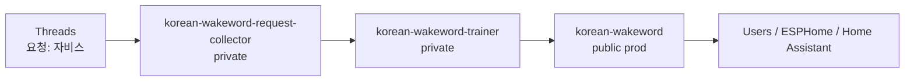
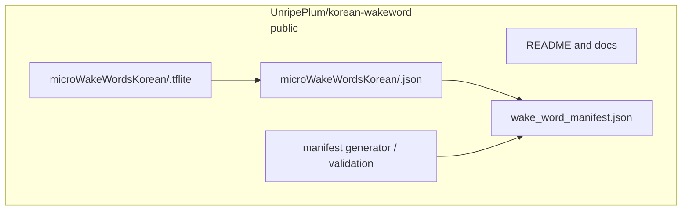

# Prod Architecture

## Role

`UnripePlum/korean-wakeword` is the public prod repository.

It stores finished Korean wakeword artifacts, the public manifest, and user-facing documentation. It does not run local training and does not own the self-hosted runner.

## System Architecture



## Prod Repository Internals



## Responsibilities

Prod owns:

- public project docs;
- published `.json` wakeword descriptors;
- published `.tflite` wakeword models;
- public manifest;
- manifest generation and validation scripts;
- public issue feedback about published models.

Prod does not own:

- Threads polling;
- follower or allowlist decisions;
- private request mappings;
- self-hosted runner workflow;
- local trainer cache;
- training secrets.

## Artifact Contract

Each successful trainer job writes:

```text
microWakeWordsKorean/<artifact_slug>.json
microWakeWordsKorean/<artifact_slug>.tflite
```

Then it updates:

```text
wake_word_manifest.json
```

## Source of Writes

Artifacts are written by `UnripePlum/korean-wakeword-trainer`.

The trainer may push directly for MVP. Later, it can open pull requests for manual artifact review.
