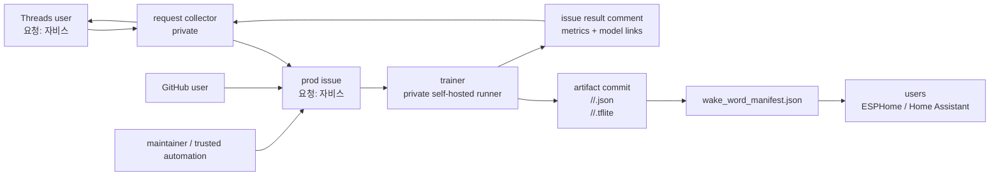
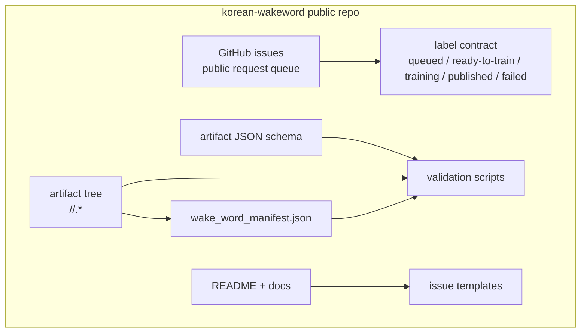
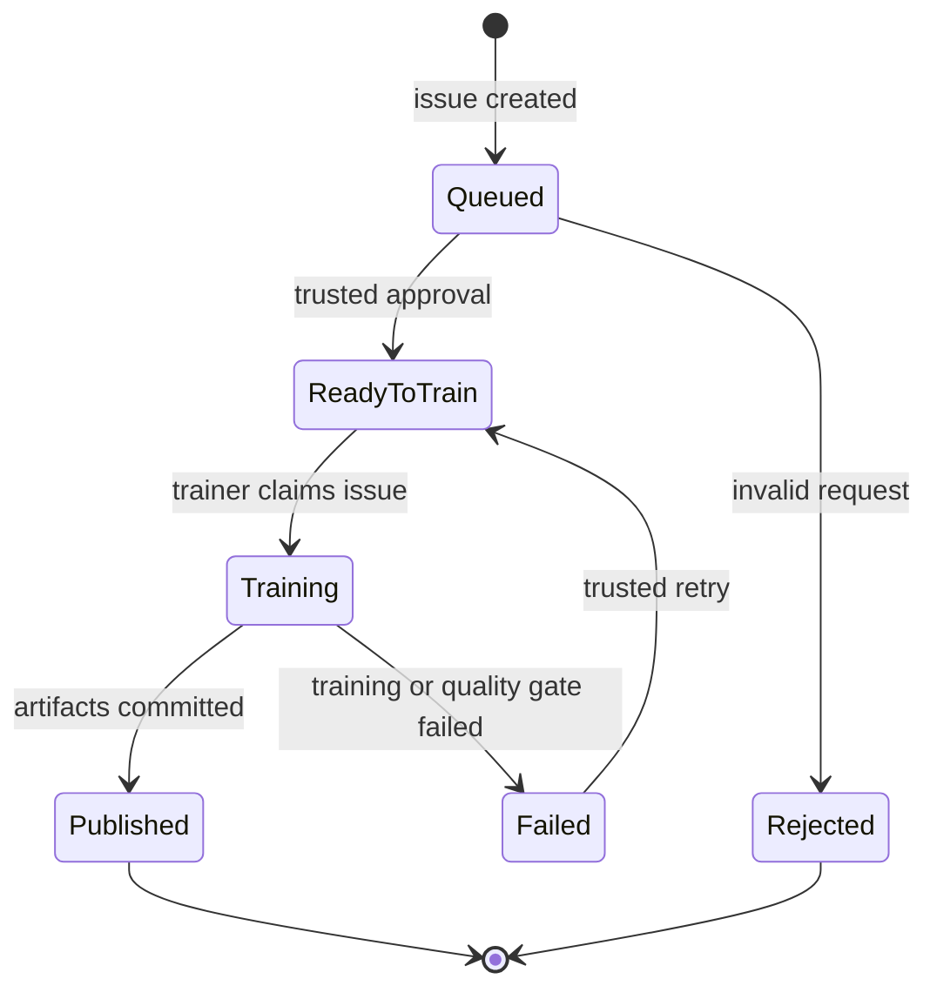
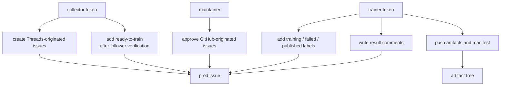

# Prod Architecture

## Role

`UnripePlum/korean-wakeword` is the public production repository.

It is the public request queue, source-visible project home, model artifact catalog, and user-facing documentation site for Korean wakeword models. It must not run private training jobs and must not own a self-hosted runner.

## System Boundary

Mermaid code:

```text
flowchart LR
    THREADS["Threads user<br/>요청: 자비스"] --> COLLECTOR["request collector<br/>private"]
    GITHUB_USER["GitHub user"] --> ISSUE["prod issue<br/>요청: 자비스"]
    COLLECTOR --> ISSUE
    MAINTAINER["maintainer / trusted automation"] --> ISSUE
    ISSUE --> TRAINER["trainer<br/>private self-hosted runner"]
    TRAINER --> ARTIFACTS["artifact commit<br/><slug>/<date>/<slug>.json<br/><slug>/<date>/<slug>.tflite"]
    TRAINER --> COMMENT["issue result comment<br/>metrics + model links"]
    ARTIFACTS --> MANIFEST["wake_word_manifest.json"]
    MANIFEST --> USERS["users<br/>ESPHome / Home Assistant"]
    COMMENT --> COLLECTOR
    COLLECTOR --> THREADS
```



Public issues are visible and editable by users. Training still starts only after a trusted actor adds `ready-to-train`.

## Internal Architecture

Mermaid code:

```text
flowchart TD
    subgraph PROD["korean-wakeword public repo"]
        DOCS["README + docs"]
        ISSUES["GitHub issues<br/>public request queue"]
        LABELS["label contract<br/>queued / ready-to-train / training / published / failed"]
        SCHEMA["artifact JSON schema"]
        TREE["artifact tree<br/><slug>/<date>/<slug>.*"]
        MANIFEST["wake_word_manifest.json"]
        VALIDATOR["validation scripts"]
        TEMPLATES["issue templates"]
    end

    ISSUES --> LABELS
    TREE --> MANIFEST
    SCHEMA --> VALIDATOR
    TREE --> VALIDATOR
    MANIFEST --> VALIDATOR
    DOCS --> TEMPLATES
```



## External Interfaces

### Request Issue

Issue title:

```text
요청: <wakeword>
```

Collector-created issue body:

```json
{
  "schema_version": 1,
  "source": "threads",
  "collector_request_id": "req_20260602_a1b2c3d4",
  "raw_phrase": "자비스",
  "normalized_phrase": "자비스",
  "language": "ko",
  "artifact_slug": "jarvis",
  "created_at": "2026-06-02T00:00:00Z"
}
```

GitHub-created issues may omit the JSON body. In that case, the trainer derives the phrase from the title only after `ready-to-train` is added by a maintainer or trusted automation.

Request validation:

- normalized Korean wakeword length is at most 8 Hangul syllable characters;
- whitespace is normalized before counting;
- requests over the limit must be rejected or edited before `ready-to-train`.

### Labels

- `queued`: request is visible in the public queue.
- `ready-to-train`: trusted execution gate.
- `training`: trainer claimed the request.
- `published`: artifacts were committed and manifest was updated.
- `failed`: training or quality gate failed.
- `rejected`: request is invalid or not allowed.
- `retryable`: request can be retried by a trusted actor.

### Artifact Paths

```text
<artifact_slug>/<generation_start_date>/<artifact_slug>.json
<artifact_slug>/<generation_start_date>/<artifact_slug>.tflite
wake_word_manifest.json
```

Example:

```text
jarvis/2026-06-02/jarvis.json
jarvis/2026-06-02/jarvis.tflite
```

`artifact_slug` is the English-safe wakeword folder name derived from the Korean phrase, for example `jarvis` or `nukjuk`. It must be lowercase ASCII and safe as a Git path segment.

`generation_start_date` is the date when trainer generation starts, formatted as `YYYY-MM-DD`.

### Model JSON

The model JSON must include `trainer_version`.

Recommended shape:

```json
{
  "schema_version": 1,
  "wakeword": {
    "display": "자비스",
    "slug": "jarvis",
    "language": "ko"
  },
  "artifact": {
    "generation_start_date": "2026-06-02",
    "model_path": "jarvis/2026-06-02/jarvis.tflite",
    "json_path": "jarvis/2026-06-02/jarvis.json"
  },
  "trainer": {
    "trainer_version": "0.1.0",
    "source": "UnripePlum/korean-wakeword-trainer"
  },
  "metrics": {
    "recall": 0.91,
    "false_accepts_per_hour": 0.7
  },
  "runtime": {
    "probability_cutoff": 0.5,
    "sliding_window_size": 5,
    "feature_step_size": 10,
    "tensor_arena_size": 22860
  },
  "request": {
    "prod_issue": 123,
    "source": "threads"
  }
}
```

## Issue State Machine

Mermaid code:

```text
stateDiagram-v2
    [*] --> Queued: issue created
    Queued --> ReadyToTrain: trusted approval
    Queued --> Rejected: invalid request
    ReadyToTrain --> Training: trainer claims issue
    Training --> Published: artifacts committed
    Training --> Failed: training or quality gate failed
    Failed --> ReadyToTrain: trusted retry
    Published --> [*]
    Rejected --> [*]
```



## Write Permissions

Mermaid code:

```text
flowchart TD
    COLLECTOR["collector token"] --> CREATE["create Threads-originated issues"]
    COLLECTOR --> TRUSTED_LABEL["add ready-to-train<br/>after follower verification"]
    MAINTAINER["maintainer"] --> GITHUB_LABEL["approve GitHub-originated issues"]
    TRAINER["trainer token"] --> CLAIM["add training / failed / published labels"]
    TRAINER --> PUSH["push artifacts and manifest"]
    TRAINER --> COMMENT["write result comments"]

    CREATE --> ISSUE["prod issue"]
    TRUSTED_LABEL --> ISSUE
    GITHUB_LABEL --> ISSUE
    CLAIM --> ISSUE
    PUSH --> ARTIFACTS["artifact tree"]
    COMMENT --> ISSUE
```



Do not attach a self-hosted runner to this repository. The public repository can contain source code, validation scripts, and artifact metadata, but execution belongs to the private trainer repo.

## Parallel Work Units

- Issue queue: labels, issue template, request examples, public status wording.
- Artifact contract: JSON schema, path validator, manifest shape.
- Manifest tooling: generate `wake_word_manifest.json` from artifact folders.
- Public docs: request guide, artifact usage guide, model compatibility notes.
- Release hygiene: validation command that can run before trainer pushes artifacts.

## Non-Goals

- Threads polling.
- Follower verification.
- Local training execution.
- Self-hosted runner configuration.
- Private logs, caches, or secrets.
