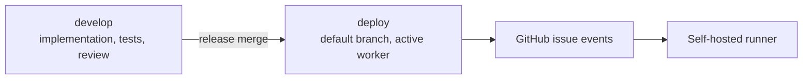

# Branching Policy

`korean-wakeword-worker` is public and has two long-lived branches.

## Branches



## `develop`

Use `develop` for:

- worker implementation;
- tests;
- parser and issue contract changes;
- training wrapper changes;
- publishing logic changes.

No issue-triggered self-hosted runner workflow should execute from `develop`.

## `deploy`

Use `deploy` for:

- active worker workflow;
- self-hosted runner job definition;
- released worker code.

`deploy` is the GitHub default branch. GitHub issue events run workflows from the default branch, so the deployed worker workflow must live on `deploy`.

## Release Rule

Changes move in one direction:

```text
develop -> deploy
```

Before merging to `deploy`:

- parser tests pass;
- issue payload tests pass;
- no shell interpolation of issue text;
- publishing target is `UnripePlum/korean-wakeword`;
- self-hosted runner labels are unchanged unless intentionally updated.

## Emergency Rollback

Rollback means moving `deploy` back to the last known good commit and disabling the active training label path if needed.

Do not delete `develop` or `deploy`.
